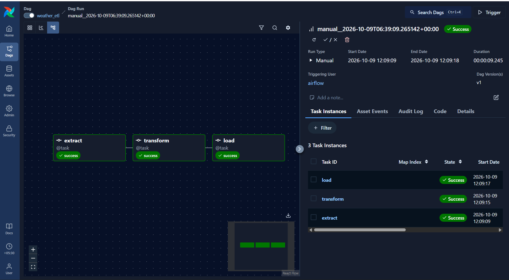
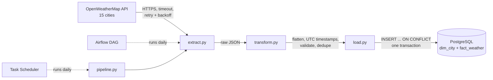
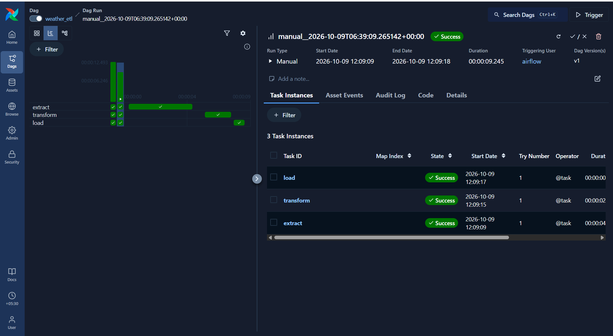

# Automated Weather Data ETL Pipeline

A daily batch pipeline that pulls current weather for 15 cities from the OpenWeatherMap API, validates it with pandas, and loads it into a PostgreSQL star schema using idempotent upserts. It runs from the command line, in Docker Compose, on a Windows Task Scheduler schedule, or as an Apache Airflow DAG, all using the same tested Python modules.

**Stack:** Python 3.11 · pandas · requests · PostgreSQL 17 · psycopg2 · pytest · Docker Compose · Apache Airflow 3



## Architecture



| Stage | What it does |
|---|---|
| **Extract** | Calls the API for each city in `config/cities.json` with a 10 s timeout. Retries timeouts, `429` and `5xx` up to 3 times with exponential backoff (1 s, 2 s). Does not retry `401`/`404`. Skips a city that keeps failing; raises if **every** city fails. |
| **Transform** | Pure functions (no I/O): flattens nested JSON, converts Unix time to UTC, validates, and splits the result into a dimension table and a fact table. |
| **Load** | Upserts `dim_city` then `fact_weather` in a single transaction with `execute_values` (one round trip per table). |

## Data model

A star schema: one dimension table for cities, one fact table for observations.

```sql
CREATE TABLE dim_city (
    city_id    INTEGER PRIMARY KEY,         -- OpenWeatherMap city id
    city_name  TEXT NOT NULL,
    country    TEXT,
    latitude   NUMERIC(8,5),
    longitude  NUMERIC(8,5)
);

CREATE TABLE fact_weather (
    city_id          INTEGER REFERENCES dim_city(city_id),
    observed_at_utc  TIMESTAMP NOT NULL,
    temperature_c    NUMERIC(5,2),
    feels_like_c     NUMERIC(5,2),
    humidity_pct     INTEGER,
    pressure_hpa     INTEGER,
    wind_speed_ms    NUMERIC(5,2),
    weather_main     TEXT,
    loaded_at        TIMESTAMP DEFAULT (NOW() AT TIME ZONE 'UTC'),
    PRIMARY KEY (city_id, observed_at_utc)
);
```

City attributes are stored once in `dim_city` instead of being repeated on every observation. The composite primary key on `fact_weather` is what makes reruns safe (see below).

## Design decisions

**Idempotent loads.** Each observation is keyed on `(city_id, observed_at_utc)`, where the timestamp is the API's observation time, not the time the pipeline ran. Loads use `INSERT ... ON CONFLICT DO UPDATE`, so running the pipeline twice updates rows in place instead of duplicating them. An integration test loads identical data twice and asserts the row count stays at one.

**Incremental, not full, loads.** Each run adds the latest observation per city and leaves history untouched, so the table grows into a time series without being rebuilt.

**Validation before loading.** Rows are dropped if `city_id` or the timestamp is missing, temperature is outside −90 to 60 °C, or humidity is outside 0–100 %. Duplicates on the primary key are removed, and the number of dropped rows is logged as a warning. The temperature rule exists because a missing `units=metric` parameter makes the API silently return Kelvin.

**Failing loudly.** Any unhandled error is logged with its traceback and the process exits with code `1`, so Task Scheduler, Docker and Airflow all record the run as failed.

**Everything in UTC.** Observation times, load times and log timestamps are all UTC, which avoids mixing time zones from cities around the world (and the database server's own local time zone).

**Secrets out of code and images.** The API key and database credentials live in a git-ignored `.env`, are excluded from the Docker image by `.dockerignore`, and are injected at run time.

## Project structure

```
├── src/
│   ├── config.py        # settings from .env; absolute paths
│   ├── extract.py       # API calls with timeout, retries, backoff
│   ├── transform.py     # pure pandas functions: flatten, convert, validate, split
│   ├── load.py          # psycopg2 upserts in one transaction
│   ├── logger.py        # console + logs/pipeline.log, UTC timestamps
│   └── pipeline.py      # entry point: extract -> transform -> load
├── tests/               # 20 pytest tests (unit, mocked API, DB integration)
├── sql/schema.sql       # table definitions
├── config/cities.json   # cities to fetch
├── dags/weather_dag.py  # Airflow DAG
├── airflow/             # trimmed official Airflow docker-compose
├── scripts/register_task.ps1  # Windows Task Scheduler setup
├── Dockerfile
└── docker-compose.yml   # postgres + pipeline
```

## Running it

### Prerequisites

- An OpenWeatherMap API key (free plan). New keys can take up to 2 hours to activate.
- Either Python 3.11 and PostgreSQL, or just Docker Desktop.

Copy the template and fill in your values:

```bash
cp .env.example .env      # Windows: copy .env.example .env
```

### Option 1: Docker Compose (one command)

```bash
docker compose up --build
```

This starts PostgreSQL, creates the tables from `sql/schema.sql`, waits for the database to be healthy, runs the pipeline once and exits. The database is published on host port **5433** so it doesn't clash with a local PostgreSQL:

```bash
psql -h localhost -p 5433 -U <DB_USER> -d <DB_NAME>
```

### Option 2: Local Python

```bash
python -m venv venv
venv\Scripts\activate            # Windows; on macOS/Linux: source venv/bin/activate
pip install -r requirements.txt

psql -U postgres -c "CREATE DATABASE weather_db;"
psql -U postgres -d weather_db -f sql/schema.sql

python -m src.pipeline
```

Example output:

```
2026-10-09 06:09:02,764 UTC INFO src.extract: Extracted 15 of 15 cities
2026-10-09 06:09:02,773 UTC INFO src.transform: Validation: kept 15 of 15 rows
2026-10-09 06:09:02,816 UTC INFO src.load: Upserted 15 rows into dim_city
2026-10-09 06:09:02,819 UTC INFO src.load: Upserted 15 rows into fact_weather
2026-10-09 06:09:02,823 UTC INFO __main__: Pipeline finished in 5.4s
```

### Scheduling

**Windows Task Scheduler:** registers a daily 09:00 run (runs on battery, catches up after a missed run):

```powershell
powershell -ExecutionPolicy Bypass -File scripts\register_task.ps1
```

**Apache Airflow:** a trimmed version of the official compose file (LocalExecutor, no example DAGs):

```bash
cd airflow
docker compose up -d     # UI at http://localhost:8080, login airflow / airflow
docker compose down
```

The DAG (`dags/weather_dag.py`) runs `extract → transform → load` as three tasks on a `@daily` schedule with 2 retries per task, 5 minutes apart. It contains no ETL logic of its own; it calls the same functions in `src/`.



## Tests

```bash
pytest -v                       # all 20 tests
pytest -m "not integration"     # 18 tests that need no database
```

| File | Tests | What they cover |
|---|---|---|
| `test_transform.py` | 8 | JSON flattening, empty `weather` list, UTC conversion, each validation rule, dimension/fact split |
| `test_extract.py` | 10 | `requests.get` is mocked: success, no retry on `401`/`404`, retry on `5xx`/`429`/timeouts, backoff timing, skipping failed cities, raising when all fail |
| `test_load_idempotency.py` | 2 | Against real PostgreSQL: loading the same data twice leaves one row; reloading a corrected value updates it in place |

## Sample query

Latest reading per city, using a window function:

```sql
WITH ranked AS (
    SELECT c.city_name, f.temperature_c, f.humidity_pct, f.weather_main,
           ROW_NUMBER() OVER (PARTITION BY f.city_id
                              ORDER BY f.observed_at_utc DESC) AS rn
    FROM fact_weather f
    JOIN dim_city c ON c.city_id = f.city_id
)
SELECT city_name, temperature_c, humidity_pct, weather_main
FROM ranked
WHERE rn = 1
ORDER BY temperature_c DESC
LIMIT 5;
```

| city_name | temperature_c | humidity_pct | weather_main |
|---|---|---|---|
| Dubai | 38.71 | 34 | Clear |
| Hanumāngarh | 35.76 | 19 | Clear |
| Surat | 35.65 | 35 | Clear |
| Chennai | 33.50 | 62 | Clouds |
| Jaipur | 33.19 | 23 | Clear |

## What I'd improve

- **Concurrent API calls.** Extract accounts for nearly all of the 5–18 s runtime because the 15 requests run one after another. Threads or async requests, kept under the API's 60-calls-per-minute limit, would be needed to scale to thousands of cities.
- **Fail fast on database errors.** The pipeline currently discovers a bad database password only after spending several seconds calling the API. A connection check at startup would catch it immediately.
- **Schema migrations.** `schema.sql` only creates missing tables, so changes to an existing table had to be applied by hand with `ALTER TABLE`. A migration tool such as Alembic would version these changes.
- **`TIMESTAMPTZ` instead of `TIMESTAMP`.** Storing naive UTC works but relies on convention; `TIMESTAMPTZ` makes the time zone explicit.
- **Staging storage between Airflow tasks.** DataFrames are passed between tasks through XCom, which is fine for 15 rows. At scale, extract should write to object storage or a staging table and pass only the location.
- **Log rotation and alerting.** The log file grows indefinitely; `TimedRotatingFileHandler` would cap it, and Airflow could send an email or Slack message on failure.
- **CI.** Running the unit tests on every push with GitHub Actions.
- **Smaller Docker image.** The pipeline image is 442 MB, mostly pandas and NumPy; a multi-stage build and excluding `tests/` would reduce it.
